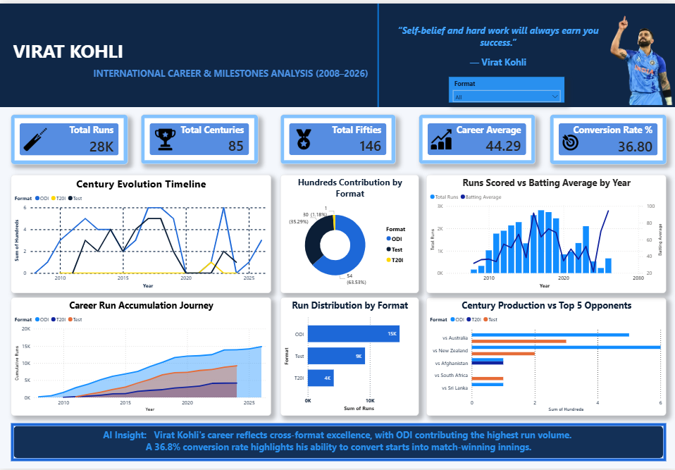

# 🏏 Virat Kohli International Career Analytics (2008–2026)



## 📌 Executive Summary

**Virat Kohli International Career Analytics** is an end-to-end data analytics project that explores the performance journey of one of cricket's most successful modern-era batsmen.

The project analyzes international career statistics from **2008 to 2026**, covering batting performance, format-wise contribution, milestone achievements, consistency trends, and opponent analysis.

The solution follows a complete analytics workflow:

**Data Extraction → Data Cleaning → Database Storage → Business Intelligence Dashboard → AI-Driven Insights**

The final interactive dashboard was developed using **Microsoft Power BI** to transform raw cricket statistics into meaningful analytical insights.

---

# 🔄 End-to-End Pipeline Architecture

```
Raw Cricket Data (CSV)
          |
          ↓
Python ETL Pipeline
(Pandas, Data Cleaning, Transformation)
          |
          ↓
SQLite Database
(Relational Data Storage)
          |
          ↓
Power BI Data Model
(DAX Measures + Visual Analytics)
          |
          ↓
Interactive Career Analytics Dashboard
          |
          ↓
Generative AI Career Insights
```

---

# 📊 Key Insights & Metrics

The dashboard provides analysis across:

### Career Overview
- Total international runs
- Total centuries and fifties
- Career batting average
- 50+ score conversion efficiency

### Performance Analysis
- Year-wise run progression
- Century evolution timeline
- Career consistency trends
- Format-wise performance comparison

### Format Contribution

Analysis across:

- ODI
- Test
- T20I

Including:
- Run contribution
- Century distribution
- Performance efficiency

### Milestone & Opponent Analysis

- Major career milestones
- Century production against opponents
- Long-term career growth trajectory

---

# 🛠️ Tech Stack

## Data Processing
- Python
- Pandas
- Data Cleaning & Transformation
- ETL Pipeline Development

## Database
- SQLite
- Relational data storage
- Structured analytical queries

## Visualization & BI
- Microsoft Power BI Desktop
- Data Modeling
- DAX Measures
- Interactive Dashboard Design

## Generative AI
- AI-generated analytical summaries
- Automated storytelling insights
- Presentation assistance

---

# 📈 Dashboard Preview

The Power BI dashboard includes:

- Executive career overview
- Performance trends
- Format comparison
- Milestone timeline
- Opponent analysis
- AI-generated career insights

---

# 📚 Project Highlights

✔ Complete ETL workflow  
✔ Structured database storage  
✔ Business-focused analytics approach  
✔ Interactive Power BI dashboard  
✔ Data storytelling using cricket statistics  
✔ Generative AI integration for insights  

---

# ⚠️ Image & Media Disclaimer

This project is created solely for **educational and personal portfolio demonstration purposes**.

Player imagery, names, logos, trademarks, and related branding elements belong to their respective owners, including **BCCI, ICC, and other associated rights holders**.

The use of player imagery in this repository is intended only for non-commercial data visualization and analytical presentation under fair-use principles. No affiliation, sponsorship, or endorsement by Virat Kohli, BCCI, ICC, or any related organization is implied.
